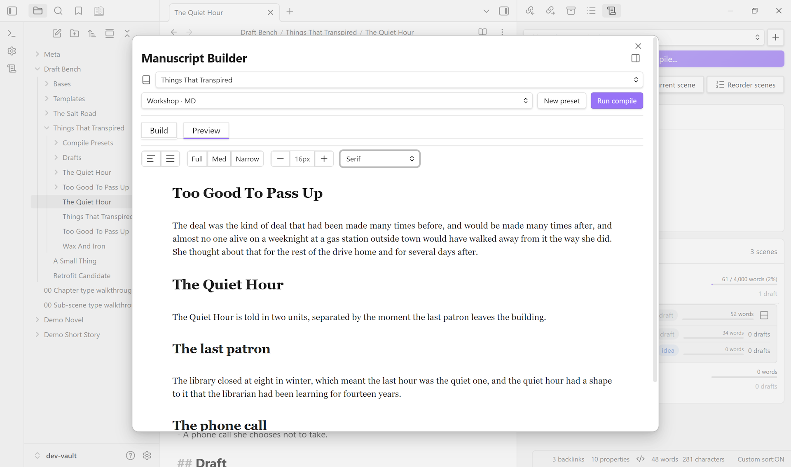
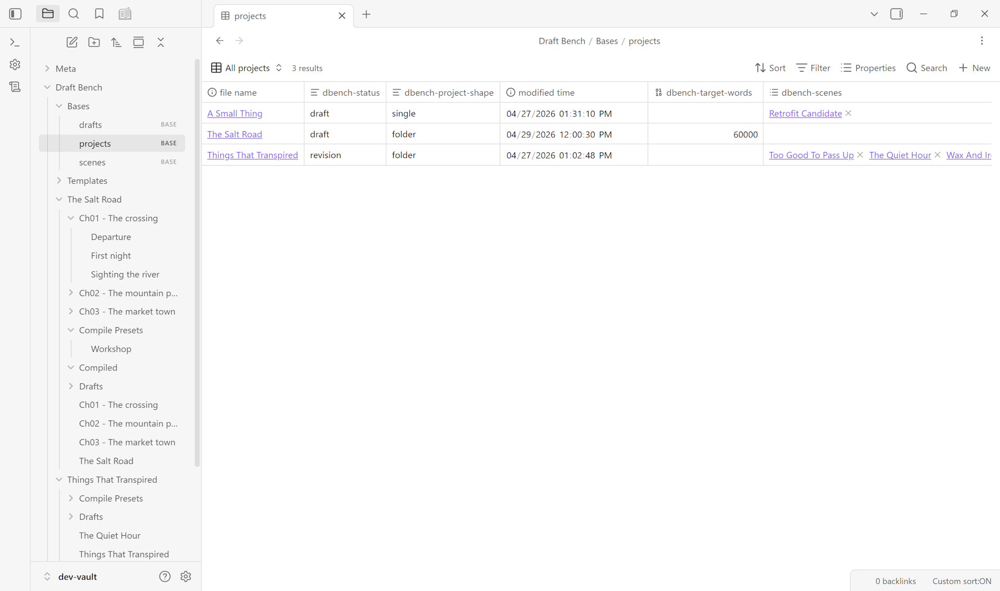

  

**A writing workflow for Obsidian.** Manage projects, scenes, and versioned drafts in plain markdown, with flexible folder structure and native compatibility with Obsidian Bases.

Draft Bench is inspired by [Longform](https://github.com/kevboh/longform), with added emphasis on per-scene draft history as first-class files, rich metadata via frontmatter, and a compile system that requires no JavaScript knowledge.

  <video controls width="800"
         src="https://draftbench.io/img/dbench-manuscript-view.webm"
         aria-label="The Manuscript view in action: a chapter card expands smoothly, a scene title opens in a new tab via Cmd-click, scene order is updated via the Reorder Scenes modal, and word counts tick live as prose is added.">
    Your browser doesn't support embedded video.
    <a href="https://draftbench.io/img/dbench-manuscript-view.webm">Watch the loop on draftbench.io</a>.
  </video>

> **Status:** 0.6.1 — current release. The full V1 feature set has shipped, plus extensions: sub-scene note type (0.2.0); Manuscript Builder Preview tab (0.3.0), dockable Manuscript Builder leaf (0.3.1), mobile support (0.3.2; Android verified, iOS / iPadOS untested), Builder-aligned Manuscript leaf restyle (0.3.3); Manuscript view Continuous mode (0.4.0); Scrivener 3 project importer (0.5.0-0.5.2); five-phase architectural audit (0.5.3); status-based scene-archive workflow (0.5.4); build-provenance attestations on every release asset (0.5.5); frontmatter type-narrowing refactor (0.6.0); scanner-hygiene patch eliminating IE-era polyfill literals from transitive dependencies (0.6.1). API and data shape may still adjust between minor versions during the 0.x phase. See [VERSIONING.md](VERSIONING.md), the [CHANGELOG](CHANGELOG.md), or the [Release History wiki page](https://github.com/banisterious/obsidian-draft-bench/wiki/Release-History) for full detail.

## What it is

- **Frontmatter-native.** Every project, scene, and draft is a plain markdown file with `dbench-*` properties. No index files, no parallel JSON stores. The vault *is* the database.
- **Versioned per-scene drafts.** Each "new draft" command snapshots a scene's current prose into its own file, carries the working draft forward, and lets you keep revising. Every prior draft remains a real file, openable in split panes for side-by-side comparison.
- **Flexible folder structure.** Scenes can live anywhere in your vault; the plugin identifies them by frontmatter, not folder location. Organize by status, POV, date, or any other scheme; nothing breaks.
- **Obsidian Bases compatible.** Every property is Bases-queryable out of the box. Build manuscript tables, status queues, and corkboards without custom configuration.
- **Compile without JavaScript.** A form-based Manuscript Builder handles compile presets, scene selection, and multi-format export (Markdown, ODT, PDF, DOCX).
- **Compile preview, in-place.** A Preview tab renders the current preset's output as continuous read-only prose, no real export file needed. Dock the Builder as a workspace tab to keep Preview pinned next to a scene you're editing; Preview re-renders as you save.
- **Scrivener 3 import.** A multi-step wizard reads a `.scriv` bundle from inside your vault and produces a fresh Draft Bench project: chapters, scenes, sub-scenes, drafts (optional), inspector content (synopses, notes, comments, footnotes, keywords), and custom metadata. Cross-platform; works on every OS Draft Bench itself supports. See [Importing from Scrivener](https://github.com/banisterious/obsidian-draft-bench/wiki/Importing-from-Scrivener).

  

  

## Installation

### From Community Plugins (Recommended)

Click [Install in Obsidian](obsidian://show-plugin?id=draft-bench) on the plugin's Community page, or search for "Draft Bench" in Obsidian Settings -> Community plugins.

### Using BRAT (Beta access)

For early access to releases before they reach the Community Plugins directory:

1. Install [BRAT](https://github.com/TfTHacker/obsidian42-brat) from Community Plugins
2. Run command: `BRAT: Add a beta plugin for testing`
3. Enter: `https://github.com/banisterious/obsidian-draft-bench`
4. Enable Draft Bench in Settings -> Community Plugins

### Manual Installation

1. Download from [Releases](https://github.com/banisterious/obsidian-draft-bench/releases)
2. Extract to `<vault>/.obsidian/plugins/draft-bench/`
3. Reload Obsidian and enable the plugin

See [Getting Started](https://github.com/banisterious/obsidian-draft-bench/wiki/Getting-Started) for the first-project walkthrough.

## Documentation

User documentation lives at the [GitHub Wiki](https://github.com/banisterious/obsidian-draft-bench/wiki). Developer and design documentation is in the repo:

- [Specification](docs/planning/specification.md): plugin features and behavior.
- [UI/UX Reference](docs/planning/references/ui-reference.md): component patterns adapted from Charted Roots.
- [Coding Standards](docs/developer/coding-standards.md): TypeScript and CSS conventions.
- [Code Architecture](docs/developer/architecture.md): `src/` layout and layering.

## Community & Support

- [Report a bug or request a feature](https://github.com/banisterious/obsidian-draft-bench/issues)
- [GitHub Discussions](https://github.com/banisterious/obsidian-draft-bench/discussions)
- [Release notes](https://github.com/banisterious/obsidian-draft-bench/releases)

## Non-goals

Draft Bench is deliberately not an AI writing assistant, a grammar checker, a text-editor replacement, a collaboration tool, or a submission tracker. It provides structural and workflow scaffolding; the words are yours. See [the specification](docs/planning/specification.md) for the full list.

## License

[MIT](LICENSE.md).
