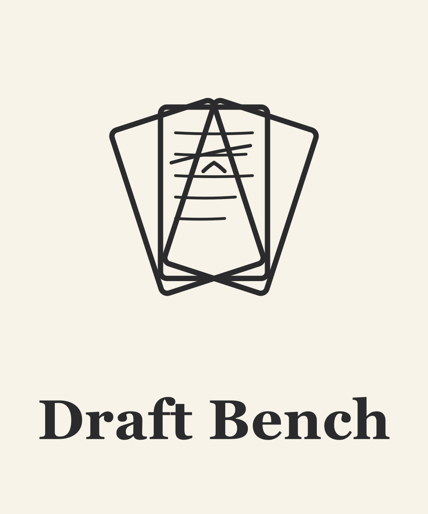

  

**A writing workflow for Obsidian.** Manage projects, scenes, and versioned drafts in plain markdown, with flexible folder structure and native compatibility with Obsidian Bases.

Draft Bench is inspired by [Longform](https://github.com/kevboh/longform), with added emphasis on per-scene draft history as first-class files, rich metadata via frontmatter, and a compile system that requires no JavaScript knowledge.

> **Status:** Pre-release. Design is complete; V1 implementation is in progress. No public releases yet.

## What it is

- **Frontmatter-native.** Every project, scene, and draft is a plain markdown file with `dbench-*` properties. No index files, no parallel JSON stores. The vault *is* the database.
- **Versioned per-scene drafts.** Each "new draft" command snapshots a scene's current prose into its own file, carries the working draft forward, and lets you keep revising. Every prior draft remains a real file, openable in split panes for side-by-side comparison.
- **Flexible folder structure.** Scenes can live anywhere in your vault; the plugin identifies them by frontmatter, not folder location. Organize by status, POV, date, or any other scheme; nothing breaks.
- **Obsidian Bases compatible.** Every property is Bases-queryable out of the box. Build manuscript tables, status queues, and corkboards without custom configuration.
- **Compile without JavaScript.** A form-based Book Builder (Phase 3+) will support compile presets, scene selection, and multi-format export (Markdown, ODT, PDF).

## Install

Once V1 is released:

- **Community Plugins** (recommended): Settings -> Community plugins -> Browse -> "Draft Bench" -> Install -> Enable.
- **BRAT** (beta testing): Install [BRAT](https://github.com/TfTHacker/obsidian42-brat), add `banisterious/obsidian-draft-bench` as a beta plugin.
- **Manual**: Download `main.js`, `manifest.json`, `styles.css` from [GitHub Releases](https://github.com/banisterious/obsidian-draft-bench/releases) into `<vault>/.obsidian/plugins/draft-bench/`.

See [Getting Started](https://github.com/banisterious/obsidian-draft-bench/wiki/Getting-Started) once the wiki is live.

## Documentation

User documentation will live at the [GitHub Wiki](https://github.com/banisterious/obsidian-draft-bench/wiki) (coming soon). Developer and design documentation is in the repo:

- [Specification](docs/planning/specification.md): plugin features and behavior.
- [UI/UX Reference](docs/planning/ui-reference.md): component patterns adapted from Charted Roots.
- [Coding Standards](docs/developer/coding-standards.md): TypeScript and CSS conventions.
- [Code Architecture](docs/developer/architecture.md): `src/` layout and layering.

## Community & Support

- [Report a bug or request a feature](https://github.com/banisterious/obsidian-draft-bench/issues)
- [GitHub Discussions](https://github.com/banisterious/obsidian-draft-bench/discussions)
- [Release notes](https://github.com/banisterious/obsidian-draft-bench/releases)

## Non-goals

Draft Bench is deliberately not an AI writing assistant, a grammar checker, a text-editor replacement, a collaboration tool, or a submission tracker. It provides structural and workflow scaffolding; the words are yours. See [the specification](docs/planning/specification.md) for the full list.

## License

[MIT](LICENSE.md).
