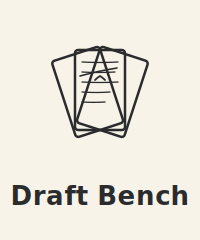

# Draft Bench — Brand Guidelines

## Files

### Mark — vector sources

| Variant | File | Intended use |
|---------|------|--------------|
| Primary (color) | [`draft-bench-graphite-on-ivory.svg`](./draft-bench-graphite-on-ivory.svg) | Default logo. Stacked lockup (mark above, wordmark below) with the ivory ground panel. Use for README headers, plugin listing, social previews, anywhere a bounded, self-identifying graphic is appropriate. |
| Monochrome — graphite | [`draft-bench-graphite.svg`](./draft-bench-graphite.svg) | Stacked lockup in graphite on a transparent background. Use on ivory, cream, or light-warm surfaces where an opaque panel would conflict. |
| Monochrome — ivory | [`draft-bench-ivory.svg`](./draft-bench-ivory.svg) | Stacked lockup in ivory on a transparent background. Use on dark or saturated surfaces where the graphite would lose contrast. |
| Favicon mark | [`draft-bench-favicon-mark.svg`](./draft-bench-favicon-mark.svg) | Simplified variant with fan pages only — no wordmark, no editor's marks, thickened strokes. Use exclusively at 32 px and below, where only the mark is legible. |

All three stacked-lockup SVGs use `viewBox="0 0 200 240"` and are interchangeable at the same rendered dimensions. The favicon mark uses `viewBox="0 0 200 200"` (square).

### Mark — raster exports

| Variant | 1024 px | 512 px |
|---------|---------|--------|
| Primary (color) | `draft-bench-graphite-on-ivory-1024.png` | `draft-bench-graphite-on-ivory-512.png` |
| Monochrome — graphite | `draft-bench-graphite-1024.png` | `draft-bench-graphite-512.png` |
| Monochrome — ivory | `draft-bench-ivory-1024.png` | `draft-bench-ivory-512.png` |

The stacked-lockup PNGs preserve the 200×240 aspect ratio (approximately 1024×1228 or 512×614 at the stated widths). The monochrome PNGs have transparent backgrounds. Render from the SVG sources via Inkscape — see the Typography section for font availability notes.

### Horizontal lockup

| File | Use |
|------|-----|
| [`draft-bench-horizontal.svg`](./draft-bench-horizontal.svg) | Website header and nav bars. Mark on the left, "Draft Bench" wordmark on the right, in landscape orientation. Target render height 40–60 px. |

### Social card

| Variant | File | Intended use |
|---------|------|--------------|
| Social card (vector) | [`draft-bench-social-card.svg`](./draft-bench-social-card.svg) | Master source at 1200 × 630. Live text, editable in Inkscape. |
| Social card (raster) | `draft-bench-social-card.png` | Upload target for GitHub repo social preview (Settings → General → Social preview). GitHub does not accept SVG. |

### Favicons and PWA icons

| File | Size | Use |
|------|------|-----|
| `favicon.ico` | 16/32/48 multi | Browser tab favicon (legacy fallback). Bundled from the favicon mark at 16, 32, 48. |
| `favicon-32.png` | 32×32 | Modern browser favicon. From the favicon mark. |
| `favicon-180.png` | 180×180 | Apple touch icon (iOS home screen). From the primary stacked lockup — at 180 px, the full mark and wordmark both read. |
| `icon-192.png` | 192×192 | Android / PWA standard icon. From the primary stacked lockup. |
| `icon-512.png` | 512×512 | PWA maskable icon / splash. From the primary stacked lockup. |

Use the simplified favicon mark only for the 32 and 16 px rasters. Above the 120 px minimum, the full stacked lockup is the correct source.

## Color palette

| Role | Name | Hex | Notes |
|------|------|-----|-------|
| Ink | Graphite | `#2B2B2D` | Near-black with a slight blue undertone. Evokes pencil-on-paper rather than sharp inked black. |
| Ground | Ivory | `#F7F3E9` | Slightly cooler than traditional cream — more "fresh paper" than "aged parchment." |

Draft Bench uses a single two-color palette. There is no alternate color variant by design: the mark's handwritten character depends on warm paper-to-graphite contrast, and introducing a second palette would dilute the identity.

## Typography

| Role | Typeface | Weight | Treatment |
|------|----------|--------|-----------|
| Wordmark (stacked lockup) | Fraunces | 600 | Title case, 26 px reference size with letter-spacing 0.3 |
| Wordmark (horizontal lockup) | Fraunces | 600 | Title case, 60 px reference size |
| Social card title | Fraunces | 600 | Title case, 76 px |
| Social card tagline | Fraunces | 500, italic | Sentence case, 28 px, period at end |
| Display headings (website, README) | Fraunces | 600 | Title case, 36–56 px |
| Body copy | Fraunces | 400 | Sentence case, 18 px, line-height 1.6 |

Fraunces was chosen for its warm, expressive letterforms that pair naturally with the handwritten character of the mark. Its rounded terminals and slightly flared serifs echo the mark's softened corners and arced strokes.

**Font availability.** The source SVGs reference Fraunces via `@font-face` from jsDelivr, which renders correctly in any online context (GitHub, plugin listings, documentation sites). For rasterizing with Inkscape or other offline tools, Fraunces must be installed as a system font. To install: Google Fonts → Fraunces → Download family → right-click each `.ttf` → Install.

**Alternative: flatten text to paths.** For contexts where font reliability matters more than future editability (print, third-party embedding), convert text to outline paths:

- Inkscape (GUI): Open the SVG → <kbd>Ctrl+A</kbd> → <kbd>Path → Object to Path</kbd> → Save As.
- Inkscape (CLI): `inkscape --export-type=svg --export-text-to-path input.svg -o output.svg`

Keep the live-text versions as sources; produce flattened versions for distribution as needed.

## Tagline

> A writing workflow for Obsidian.

Six words, sentence case, period at the end. Used in the social card, the README header, the GitHub repo description, and the Obsidian Community Plugin directory entry.

- *Workflow* is the operative word — it distinguishes Draft Bench from single-purpose plugins and signals the end-to-end scope.
- *For Obsidian* positions the plugin as native-citizen rather than a port.
- Ends with a period, not an em dash or ellipsis. The plugin does one thing well and says so simply.

## Clearspace and minimum size

**Clearspace.** Reserve a margin equivalent to the mark's visible width on all sides of the stacked lockup when placing it next to other elements. At the reference size (roughly 100 pixel mark width), that is roughly 100 pixels of clear space. No text, image, or interface element should enter this zone.

**Minimum size.** Do not render the full stacked lockup below **120 pixels wide** on screen. Below this threshold, the editor's marks become illegible and the wordmark loses its Fraunces character. For rendering at 32 px and below, use the simplified favicon mark (mark only, no wordmark).

## Do's and Don'ts

**Do:**

- Preserve the two-color palette exactly as specified above.
- Maintain the internal proportions — the fan angles, page dimensions, text line distribution, editor's marks, and mark-to-wordmark relationship are tuned together.
- Prefer the primary (graphite on ivory) wherever the ground permits it.
- Use the monochrome variants for contexts where the ivory panel would conflict with the surrounding surface.
- Use the simplified favicon mark at 32 px and below.
- Treat the mark and wordmark as a unit — they're designed to travel together.

**Don't:**

- Recolor the mark outside the approved palette. No substituting other near-blacks, browns, blues, or background tones.
- Stretch, skew, rotate, or distort the mark on any axis.
- Add effects: drop shadows, glows, gradients, bevels, outer strokes.
- Place on busy, high-contrast, or photographic backgrounds that compete with the handwritten character.
- Modify the editor's marks — the strikethrough, caret, and text line arrangement are fixed.
- Separate the wordmark from the mark in the stacked lockup, or substitute a different typeface for the wordmark.
- Render below the minimum size, or upscale a rasterized export — always render the SVG directly, or use an appropriately-sized PNG.

## Where the logo appears

| Surface | Asset | Notes |
|---------|-------|-------|
| GitHub README (top banner) | Primary stacked SVG or 1024 PNG | Centered. 240–320 px display width. |
| GitHub Wiki Home | Primary stacked SVG or 1024 PNG | Top of page. Similar treatment to README banner. |
| GitHub repo social preview | `draft-bench-social-card.png` | Settings → General → Social preview. PNG only. |
| Obsidian plugin listing | Primary stacked SVG or 1024 PNG | At whatever size the listing accepts. |
| Documentation site | Primary stacked SVG | |
| Social posts | `draft-bench-social-card.png` or primary PNG | Card format for link previews; stacked lockup for avatars. |
| Dark-themed headers or banners | Monochrome — ivory | Transparent stacked lockup on the existing dark field. |
| Light or ivory-toned surfaces without panel | Monochrome — graphite | When the ivory panel would create a visible rectangle against a similar-toned field. |
| Control Center header (inside plugin) | Monochrome — graphite or ivory | Depending on user's Obsidian theme. Render small — 20–24 px. The wordmark may fall below legibility here; consider using the horizontal lockup if the space allows. |
| Ribbon icon | — | Use Lucide's `pencil-ruler` glyph directly, not the Draft Bench mark. The mark is for places where Draft Bench presents itself as a brand (docs, README, plugin listing), not for in-app UI. |
| Website — header / nav | Horizontal lockup SVG | 40–60 px tall. Links to the homepage. |
| Website — footer | Horizontal lockup SVG or primary stacked mark | Smaller than the header; context-dependent sizing. |
| Website — favicon | `favicon.ico` + PNG icon set | Served from the site root. Simplified favicon mark for 32 / 16 px. |
| Website — Open Graph meta | `draft-bench-social-card.png` | Share preview when links are posted elsewhere. |

Update this table whenever the logo is added to a new surface, so future revisions know where re-deployment is needed.

## Third-party use

Community members writing about Draft Bench (blog posts, videos, tutorials, meetups) may use the logo under these conditions:

- Use the unmodified vector or PNG files from this directory — don't redraw, recolor, or regenerate the mark.
- Maintain the clearspace and minimum-size rules above.
- Don't imply endorsement or official affiliation with the project unless that relationship actually exists.
- If you're unsure whether a specific use is appropriate, open a [discussion](https://github.com/banisterious/obsidian-draft-bench/discussions) — we're happy to chat.

The plugin itself is MIT-licensed, but the logo and brand assets in this directory are governed by the usage rules in this document, not by the plugin license. Practically: the code can be forked freely; the brand identity stays with the project.

## Relationship to Charted Roots

Draft Bench and Charted Roots share a developer and a design methodology, but not a visual identity. The two marks use different typefaces (Fraunces for Draft Bench, Literata for Charted Roots), different palettes (graphite on ivory vs oxblood or navy on cream), and different compositional logic (handwritten manuscript with external wordmark vs scholarly seal with inscribed text). This is intentional: they should read as distinct brands from distinct tools, not as a suite.

## Revision history

| Version | Date | Notes |
|---------|------|-------|
| 1.0 | 2026-04-23 | Initial release. Handwritten manuscript mark with editor's marks (strikethrough + caret), paired with a stacked "Draft Bench" wordmark in Fraunces 600. Palette: graphite on ivory. Core asset set: three stacked-lockup SVGs (primary plus two monochrome), horizontal lockup, social card, simplified favicon mark. |
